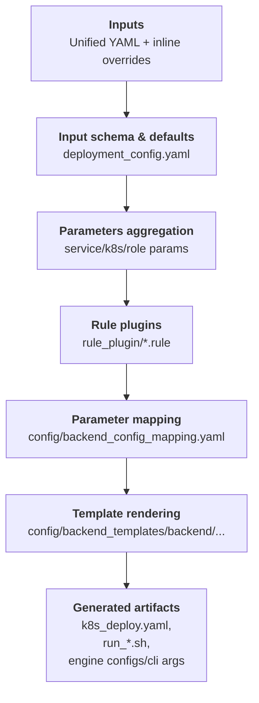

# AIConfigurator 项目说明

## 项目概述

AIConfigurator 是一个用于 LLM 推理服务的配置优化工具，专门针对分布式服务场景。给定模型、目标 GPU 系统和 SLA 目标（TTFT 和 TPOT），它搜索大型配置空间（并行策略、批大小、工作节点数量）以找到在满足延迟约束的同时最大化吞吐量的部署方案。 [1](#0-0) 

## 技术栈

### 核心依赖
- **Python**: >= 3.9 [2](#0-1) 
- **数据处理**: pandas>=2.2.3, numpy~=1.26.4, scipy>=1.13.1 [3](#0-2) 
- **可视化**: matplotlib>=3.9.4, plotly>=6.0.1, bokeh [4](#0-3) 
- **模板引擎**: jinja2>=3.1.0 [5](#0-4) 
- **配置管理**: pyyaml>=6.0 [6](#0-5) 

### 可选组件
- **Web界面**: gradio==5.47.1 [7](#0-6) 
- **API服务**: fastapi>=0.115.12, uvicorn>=0.34.2 [8](#0-7) 

### 支持的推理后端
- **TensorRT-LLM** (trtllm)
- **vLLM** 
- **SGLang** [9](#0-8) 

## 工程目录结构

```
aiconfigurator/
├── src/aiconfigurator/           # 核心源代码
│   ├── cli/                      # 命令行接口
│   │   ├── main.py              # CLI主入口
│   │   ├── example.yaml         # 示例配置
│   │   └── exps/                # 实验配置模板
│   ├── sdk/                     # 核心SDK
│   │   ├── task.py              # 任务配置
│   │   ├── perf_database.py     # 性能数据库
│   │   ├── models/              # 模型架构定义
│   │   ├── inference_session.py # 推理会话
│   │   └── pareto_analysis.py   # 帕累托分析
│   ├── generator/               # 配置生成器
│   │   ├── config/              # 生成器配置
│   │   ├── rule_plugin/         # 规则插件
│   │   └── backend_templates/   # 后端模板
│   ├── systems/                 # 系统配置和数据
│   │   ├── *.yaml              # 系统规格文件
│   │   ├── data/               # 性能数据库
│   │   └── support_matrix.csv  # 支持矩阵
│   ├── webapp/                  # Web界面
│   └── eval/                    # 评估管道
├── collector/                   # 数据收集工具
├── docs/                       # 文档
├── tests/                      # 测试
├── tools/                      # 工具脚本
└── docker/                     # Docker配置
```

## 核心功能模块

### 1. CLI 模式
- **default**: 完整参数搜索，比较聚合vs分布式部署 [10](#0-9) 
- **exp**: 基于YAML的自定义实验 [11](#0-10) 
- **generate**: 快速生成基础配置 [12](#0-11) 
- **support**: 检查模型/硬件组合支持情况 [13](#0-12) 

### 2. 配置生成器
生成部署所需的配置文件和脚本： [14](#0-13) 
- 引擎配置文件 (YAML)
- 启动脚本 (shell)
- Kubernetes 部署清单
- 基准测试脚本

### 3. 支持的硬件系统
- **H100 SXM**: TRTLLM, SGLang, vLLM [15](#0-14) 
- **H200 SXM**: TRTLLM, SGLang, vLLM [16](#0-15) 
- **B200 SXM**: TRTLLM, SGLang [17](#0-16) 
- **GB200**: TRTLLM [18](#0-17) 
- **A100 SXM**: TRTLLM, vLLM [19](#0-18) 

## 新硬件适配指南

### 1. 添加系统配置
在 `src/aiconfigurator/systems/` 目录下创建新的 YAML 文件，定义：
- GPU 内存容量和带宽
- FLOPS 性能指标
- 节点拓扑结构

### 2. 收集性能数据
使用 `collector/` 工具收集新硬件的基准数据：
- GEMM 操作性能
- 注意力机制性能
- 通信性能 (NCCL)
- MoE 路由性能

### 3. 更新支持矩阵
修改 `src/aiconfigurator/systems/support_matrix.csv` 添加新硬件的支持信息。

### 4. 测试验证
运行 `aiconfigurator cli support` 命令验证新硬件的模型支持情况。

## 部署流程

1. **配置生成**: 使用 CLI 生成最优配置 [20](#0-19) 
2. **部署准备**: 复制生成的配置文件到目标节点 [21](#0-20) 
3. **服务启动**: 执行生成的启动脚本
4. **性能验证**: 运行基准测试验证性能

## Notes

- 项目使用 Apache-2.0 许可证 [22](#0-21) 
- 当前版本为 0.7.0 [23](#0-22) 
- 支持的模型家族包括：GPT、LLaMA、MoE、Qwen、DeepSeek V3、NemotronH [24](#0-23) 
- 生成的配置文件结构包含聚合和分布式两种模式的完整部署方案 [25](#0-24) 


### Citations

**File:** README.md (L10-22)
```markdown
In disaggregated serving, configuring an effective deployment is challenging: you need to decide how many prefill and decode
workers to run, and the parallelism for each worker. Combined with SLA targets for TTFT (Time to First Token) and
TPOT (Time per Output Token), optimizing throughput at a given latency becomes even more complex.

`aiconfigurator` helps you find a strong starting configuration for disaggregated serving. Given your model, GPU
count, and GPU type, it searches the configuration space and generates configuration files you can use for deployment with Dynamo.

For a technical deep dive into the design and methodology of AIConfigurator, please refer to our paper:  
[**AIConfigurator: Lightning-Fast Configuration Optimization for Multi-Framework LLM Serving**](https://arxiv.org/abs/2601.06288).

The tool models LLM inference using collected data for a target machine and framework. It evaluates thousands of
configurations and runs anywhere via the CLI and the web app.

```

**File:** README.md (L72-76)
```markdown
- We have four modes: `default`, `exp`, `generate`, and `support`.
- Use `default` to find the estimated best deployment by searching the configuration space.
- Use `exp` to run customized experiments defined in a YAML file.
- Use `generate` to quickly create a naive configuration without a parameter sweep.
- Use `support` to verify if AIC supports a model/hardware combination for agg and disagg modes.
```

**File:** README.md (L326-332)
```markdown
- **Models**:
  - GPT
  - LLAMA (2, 3)
  - MOE
  - QWEN
  - DEEPSEEK_V3
  - Support using huggingface model id if falls into these model family and not MoE models.
```

**File:** README.md (L360-364)
```markdown
- **Inference Backends**:
  - TensorRT-LLM (trtllm)
  - vLLM
  - SGLang

```

**File:** README.md (L376-382)
```markdown
| System | Framework(Version) | Status |
|--------|-------------------|--------|
| h100_sxm | TRTLLM(1.0.0rc3, 1.2.0rc5), SGLang(0.5.6.post2), vLLM(0.12.0) | ✅ |
| h200_sxm | TRTLLM(1.0.0rc3, 1.2.0rc5), SGLang(0.5.6.post2), vLLM(0.12.0) | ✅ |
| b200_sxm | TRTLLM(1.0.0rc3, 1.2.0rc5), SGLang(0.5.6.post2) | ✅ |
| gb200 | TRTLLM(1.0.0rc3, 1.2.0rc5) | ✅ |
| a100_sxm | TRTLLM(1.0.0), vLLM(0.12.0) | ✅ |
```

**File:** pyproject.toml (L6-6)
```text
version = "0.7.0"
```

**File:** pyproject.toml (L38-38)
```text
license = "Apache-2.0"
```

**File:** pyproject.toml (L41-41)
```text
requires-python = ">=3.9"
```

**File:** pyproject.toml (L44-45)
```text
    "jinja2>=3.1.0",
    "matplotlib>=3.9.4",
```

**File:** pyproject.toml (L46-48)
```text
    "numpy~=1.26.4",
    "pandas>=2.2.3",
    "plotext>=5.3.2",
```

**File:** pyproject.toml (L51-51)
```text
    "pyyaml>=6.0",
```

**File:** pyproject.toml (L74-76)
```text
webapp = [
    "gradio==5.47.1"
]
```

**File:** pyproject.toml (L77-81)
```text
service = [
    "fastapi>=0.115.12",
    "orjson>=3.10.16",
    "uvicorn>=0.34.2"
]
```

**File:** docs/generator_overview.md (L5-14)
```markdown
### End-to-End Flow

```

**File:** docs/cli_user_guide.md (L706-718)
```markdown
```bash
aiconfigurator cli default \
  --model Qwen/Qwen3-32B-FP8 \
  --total-gpus 8 \
  --system h200_sxm \
  --ttft 600 --tpot 50 \
  --isl 4000 --osl 500 \
  --save-dir results \
  --generator-set ServiceConfig.head_node_ip=0.0.0.0 \
  --generator-set ServiceConfig.model_path=/workspace/models/Qwen3-32B-FP8
```

`--save-dir` generates deployment-ready artifacts (engine configs, run scripts, K8s manifests, and benchmark helpers) under `results/`.
```

**File:** docs/dynamo_deployment_guide.md (L160-176)
```markdown
```bash
# Create the engine_configs directory expected by the run scripts
mkdir -p /workspace/engine_configs

# Copy engine config files to the expected location (artifacts are directly under top1/, no nested agg/ or disagg/)
# For aggregated mode:
# cp ${your_save_dir}/.../agg/top1/agg_config.yaml /workspace/engine_configs/
# For disaggregated mode:
cp ${your_save_dir}/.../disagg/top1/*_config.yaml /workspace/engine_configs/

# Navigate to the generated top1 directory, then on node0:
cd ${your_save_dir}/.../disagg/top1
bash run_0.sh

# On other nodes
bash run_1.sh
```
```

**File:** docs/dynamo_deployment_guide.md (L267-294)
```markdown
````
${save_dir}/
├── agg/
│   ├── top1/
│   │   ├── agg_config.yaml
│   │   ├── bench_run.sh          # aiperf benchmark sweep script (bare-metal)
│   │   ├── generator_config.yaml
│   │   ├── k8s_bench.yaml        # aiperf benchmark sweep Job (Kubernetes)
│   │   ├── k8s_deploy.yaml
│   │   └── run_0.sh
│   ├── best_config_topn.csv
│   ├── exp_config.yaml
│   └── pareto.csv
├── disagg/
│   ├── top1/
│   │   ├── bench_run.sh          # aiperf benchmark sweep script (bare-metal)
│   │   ├── decode_config.yaml
│   │   ├── generator_config.yaml
│   │   ├── k8s_bench.yaml        # aiperf benchmark sweep Job (Kubernetes)
│   │   ├── k8s_deploy.yaml
│   │   ├── prefill_config.yaml
│   │   ├── run_0.sh
│   │   └── run_1.sh  (for multi-node setups)
│   ├── best_config_topn.csv
│   ├── exp_config.yaml
│   └── pareto.csv
└── pareto_frontier.png
````
```
