## 1. 引言

推理系统优化常被简化为硬件性能比较问题，但实际工程决策通常并不直接对应单点 benchmark。对于线上推理服务而言，架构选择同时受到 `TTFT`、`TPOT`、吞吐、成本、扩展性等多方面约束。单个硬件指标可以帮助理解设备特征，却不足以直接决定系统架构。

在过去一段时间的推理系统优化、扩容决策以及与硬件和框架供应商的协作过程中，我们逐渐意识到，很多分歧其实不在技术本身，而在于大家使用的评估口径、benchmark 场景和指标 trade-off 不一致。这样一来，不同方案很难放在一起比较，讨论也容易反复。随着模型规模、GPU 成本和业务负载持续上升，只靠经验去判断，已经越来越不够用了。

本文围绕 `L40 + A100` 异构混推案例展开，主要想说明两件事：

1. 给出本次混推方案是否值得推进的技术判断。
2. 说明这类问题更适合用什么分析框架来做判断，而不是只看单点性能。

本文并不是要否定单点性能测试，而是想把它放到更合适的位置。单点测试可以帮助我们理解硬件特征，也适合做参数校准；但一旦问题涉及业务 `SLA`、系统配置空间和成本权衡，就需要用更完整的系统级分析方法。

## 2. 方法论框架

这份报告最想做的，不是先给出某个架构结论，而是先把一套可复用的推理性能分析方法讲清楚。`L40 + A100` 混推案例的重要性，在于它能把这套方法讲明白。

### 2.1 为什么需要 top-down 视角

推理优化最难的地方，很多时候不是某个局部技术点，而是缺少一套大家都认可的分析框架。当我们面对大规模配置组合、相互冲突的目标以及动态变化的流量时，如果还是只盯着单一指标调参，就很容易陷入局部优化循环：吞吐上去了，延迟超了；延迟压下来了，成本又上去了。这样调出来的结论通常也不太容易复用。

所以，我们更需要一个自上而下的分析视角。这个视角不是先问“哪块卡更强”，而是先问“在给定业务约束下，系统的最优边界在哪里、当前配置大概处在什么位置、如果要继续优化，应该往哪个方向走”。从这个角度看，性能分析更像是一张决策地图，而不只是几个局部指标的比较。

除了口径不统一，还有一个更现实的问题，就是人工实测的工作量往往很高。对于多场景、多并发、多引擎、多部署方式这类组合问题，如果主要靠实测穷举来找最优点，时间成本会很快放大。以图中的样例为例，在 `13` 个场景、`6` 种并发数以及多种引擎与 `PD` 组合下，如果主要靠人工实测和执行，整体工作量估算可达到 `45.2` 天。
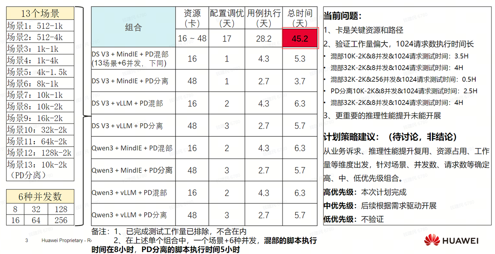
*图 1：多场景、多组合下的人工实测工作量示意。随着场景数、并发数和部署组合增加，基于实测穷举的优化方法会迅速变得不可持续，这也是引入系统化分析框架的直接动因。*

### 2.2 帕累托前沿是性能优化的地图

在这份报告里，我们把帕累托前沿当作分析性能的统一语言。简单说，所谓帕累托最优，就是一个方案想在某个目标上继续变好，就要在别的目标上做出让步；所有这样的点连起来，就是帕累托前沿。与之对应，如果方案 A 在所有目标上都不差于方案 B，且至少一项目标更好，那就可以说 A 支配 B。

对推理系统而言，`tokens/s/user` 和 `tokens/s/gpu` 是最核心的一组坐标。前者反映用户感知生成速度，直接关系到体验；后者反映单位 GPU 吞吐，直接关系到成本和容量。这两个指标天然需要一起看，所以更适合放在同一个帕累托坐标系里，而不是拆开各看各的。
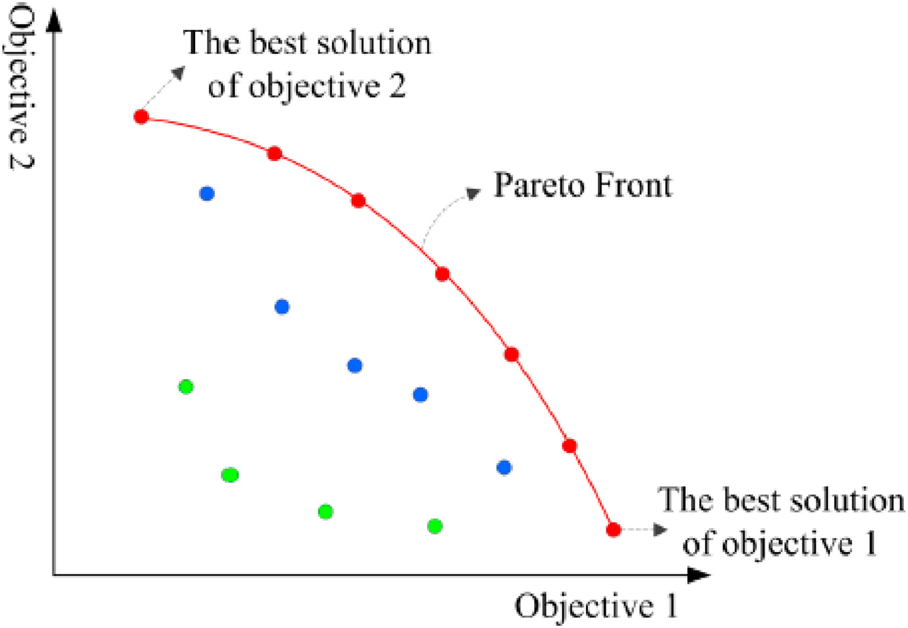
*图 2：帕累托前沿示意图。红线表示在多目标之间无法被进一步同时改进的最优边界。*

从这个视角看，配置空间大致可以分为三类区域：

- 可行区：当前大多数线上配置所在区域，通常存在明显的“免费午餐”，通过调参即可获得可观提升。
- 帕累托前沿：满足约束条件下的理论最优边界，在这里继续优化某一指标通常需要牺牲另一指标。
- 不可行区：当前技术条件下无法达到的区域，若要进入该区域，往往需要架构、算法或硬件层面的突破。

因此，我们不仅需要找到“最优点”，更需要知道当前配置距前沿有多远，以及不同方案是否位于同一条前沿上。

### 2.3 推理性能优化的三个层次

引入 top-down 视角后，我们可以把推理性能优化划分为三个层次。

- 第一层 - “可行区间到帕累托前沿”的优化：
  -   这类问题通常由交付或运维主导，优化周期以天为单位，典型手段包括 batch 调整、动态批处理、量化和执行参数调优。它解决的问题是：在现有架构不变的前提下，能否用低成本调参把当前配置推到前沿附近。
- 第二层 - “理论前沿到工程可达前沿”的优化：
  -   这类问题更多由产品研发和系统工程主导，优化周期以月为单位。帕累托前沿给出的是能力上限，但系统调度、请求合并、缓存策略和实现细节决定了这些前沿点是否真正可达。因此，系统工程的核心任务之一，是缩小理论最优与工程可达之间的差距。
- 第三层 - “旧帕累托前沿到新帕累托前沿”的优化：
  -   这类问题通常涉及架构、框架或硬件层面的改变，优化周期以季度到年度计。`Prefill / Decode` 分离、异构 GPU 组合以及新一代硬件接入，都属于这一层次。它们关注的已经不是在现有前沿里怎么取舍，而是能不能把整条性能边界往外推。
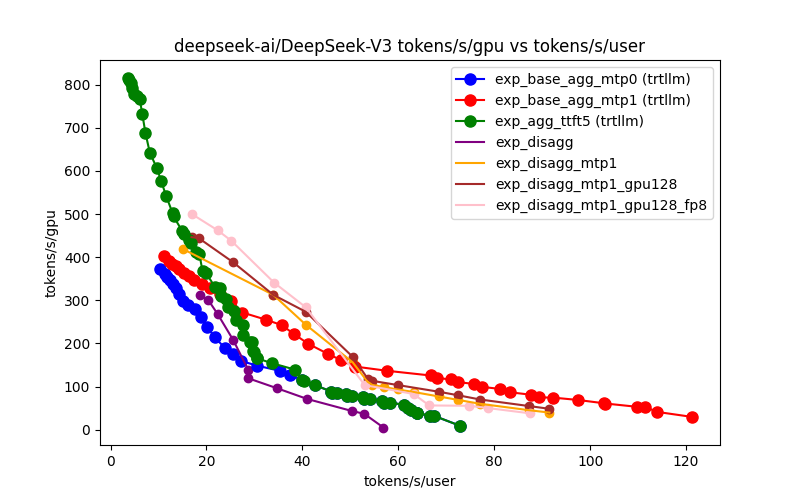
*图 3：不同技术路线会把系统带到不同的帕累托前沿上。图中的* `MTP`*、*`Disagg`*、*`GPU128`*、*`FP8` *等技术，不只是把某个点调得更好，而是在不同程度上把性能边界往外推。*

除了软件栈和系统架构之外，硬件代际变化本身也会推动帕累托前沿外移。不过在这份报告里，我们把它看作第三层优化中的一个补充维度，而不是单独展开的主线。硬件升级当然能带来更高上限，但它最终能不能变成可落地的收益，还是要和具体架构、并行策略以及业务约束放在一起看。
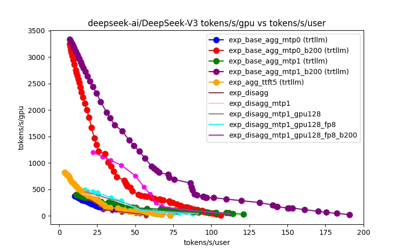
*图 4：硬件代际变化同样会改变帕累托前沿的位置。图中不同硬件与配置组合形成了不同的性能边界，说明硬件升级能够带来新的上限，但最终收益仍取决于是否与合适的架构和配置配套。*

进一步说，识别出帕累托前沿，还不等于已经做完了业务决策。即使前沿上的候选点已经找到了，最后选哪个点，还是要看业务 `SLA`。所以，一条更完整的分析链条应该是：先识别帕累托前沿，再看不同技术怎样推动前沿外移，最后在 `SLA` 约束下选出真正能上线的点。
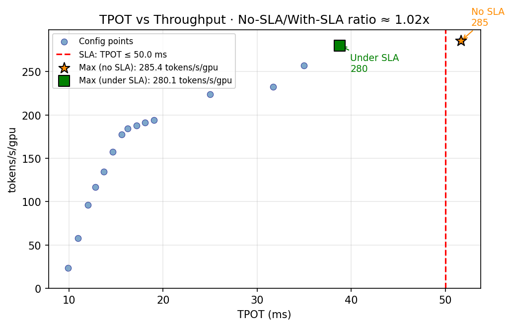
*图 5：*`SLA` *约束会改变最终最优点的选择。无约束条件下的最优吞吐点，并不一定是满足业务约束时的最优上线点。*

### 2.4 方法论如何落到具体案例

在这个框架下，具体案例的作用，不是单独去证明“某个方案更优”，而是用来展示这套方法怎么落地。也就是说，我们先把分析语言和判断标准立起来，再用一个具体案例去说明：

1. 应该如何定义目标与约束。
2. 应该如何在配置空间中识别帕累托前沿。
3. 应该如何区分局部调优、系统工程优化和架构级优化。
4. 应该如何判断一个方案的收益是否具有稳健性和可复用性。

`L40 + A100` 的混推分析，正是在这第三层优化问题上展开的：我们关注的不是怎么在既有配置里再挪一个点，而是在看这种架构调整能不能把性能边界往外推。

## 3. 案例背景与分析对象

在上述方法论框架下，我们关注的是一个具体的推理架构决策问题：在给定 `SLA` 约束下，纯 `A100` 架构与 `L40 + A100` 异构分离架构之间，哪种方案在性能、成本和稳健性上更合适。

本文讨论的核心对象包括以下几类候选架构：

- `a100_agg`：纯 `A100` 聚合架构。
- `a100_disagg`：纯 `A100` 分离架构。
- `L40_P_A100_D`：`L40` 承担 `Prefill`，`A100` 承担 `Decode` 的异构分离架构。
- `A100_P_L40_D`：与上者相反的反向异构架构。

分析覆盖三类典型请求场景：

- `Short`：`512/128`
- `Medium`：`2048/512`
- `Long`：`4000/1000`

我们使用三组指标描述系统表现：

- `tokens/s/gpu`：反映 GPU 利用效率。
- `tokens/s/user`：近似反映用户侧生成速度。
- `tokens/10k_rmb`：反映单位成本产出。

这几个指标之所以要放在一起看，是因为我们真正要找的不是单一吞吐最高点，而是在 `SLA` 约束下更合适的综合解。

## 4. 核心结论

### 4.1 Prefill / Decode 异构是合理设计

这里最重要的判断，不是哪一种 GPU 单独更强，而是 `Prefill / Decode` 分离之后，用异构资源去匹配不同阶段是合理的。因为推理链路里的两个阶段吃的资源不一样，所以统一使用同一类 GPU，不一定就是整体上更好的方案。

从结构上看，异构设计的价值在于把系统问题从“选择最强硬件”转化为“为不同阶段选择更合适的硬件”，这也是本次分析能够得出混推结论的前提。

|          |          |            |            |            |
| -------- | -------- | ---------- | ---------- | ---------- |
| **推理阶段** | **资源瓶颈** | **L40S**   | **A100**   | **匹配结论**   |
| Prefill  | 计算密集型    | 362 TFLOPS | 312 TFLOPS | L40S 更适合   |
| Decode   | 内存带宽密集型  | 864 GB/s   | 2.039 TB/s | A100 更适合   |
| 成本       | -        | ~1.5 万/月   | ~3.5 万/月   | L40S 性价比更高 |

*表 1：*`Prefill / Decode` *阶段与硬件能力匹配关系。异构方案成立，关键不在于“混搭”本身，而在于阶段瓶颈和硬件特征能对得上。*

### 4.2 Prefill 更适合低成本 GPU

`Prefill` 阶段更偏计算密集。我们采用的硬件参数表明，`L40S` 在 `FP16` 算力上高于 `A100`，而且价格明显更低。因此，在 `Prefill` 阶段使用成本更低的 GPU，并不意味着性能一定退化，反而可能获得更好的性价比。

这里想表达的不是“低成本 GPU 普遍更优”，而是“在 Prefill 这个阶段，低成本 GPU 可以承担主要任务，而且不会把整体目标打乱”。

### 4.3 Decode 更适合高带宽 GPU

与 `Prefill` 不同，`Decode` 阶段更偏内存带宽密集。`A100` 在显存带宽上显著优于 `L40S`，因此更适合承担 `Decode` 阶段的核心负载。

反向架构 `A100_P_L40_D` 在结果中明显落后，也从反面说明了这一点。换句话说，异构方案之所以成立，不是因为“混搭”本身，而是因为 `Decode` 阶段确实更吃带宽。

进一步看，以 `Long` 场景为例，不同架构的配置方式也说明了这一点：

|               |        |                 |                 |                                    |
| ------------- | ------ | --------------- | --------------- | ---------------------------------- |
| **架构**        | **类型** | **Prefill 配置**  | **Decode 配置**   | **结果解释**                           |
| 纯 A100 Disagg | 同构分离   | TP=4, workers=2 | TP=8, workers=1 | Decode 阶段 TP 过大、workers 偏少，资源利用率较低 |
| L40_P_A100_D  | 异构混推   | TP=2, workers=5 | TP=2, workers=3 | 降低 TP、增加 workers，并行度更高             |

*表 2：*`Long` *场景下的配置对比。异构方案不仅硬件匹配更合理，也带来了更灵活的并行配置空间。*

### 4.4 混推在成本敏感场景下优势显著

综合三类场景的结果，`L40_P_A100_D` 的优势是一个带约束的结论，不是脱离场景的统一结论。这里说的“更优”，成立于给定请求分布和 `SLA` 目标下，也就是 `Short (512/128, 600ms/20ms)`、`Medium (2048/512, 1500ms/40ms)`、`Long (4000/1000, 2500ms/60ms)` 这三类场景里，在系统先满足 `TTFT` 和 `TPOT` 约束之后，再去比较成本效益和用户体验。

|                   |              |                  |                   |                    |               |
| ----------------- | ------------ | ---------------- | ----------------- | ------------------ | ------------- |
| **场景**            | **推荐架构**     | **tokens/s/gpu** | **tokens/s/user** | **tokens/10k_rmb** | **关键结论**      |
| Short (512/128)   | L40_P_A100_D | 210.1            | 72.99 (+43%)      | 672.31 (+1.6%)     | 用户体验最优，成本基本持平 |
| Medium (2048/512) | L40_P_A100_D | 280.08 (+21%)    | 25.78             | 689.43 (+31%)      | 成本效益提升约 31%   |
| Long (4000/1000)  | L40_P_A100_D | 243.4 (+35%)     | 19.58             | 599.13 (+45%)      | 成本效益提升约 45%   |

*表 3：三类场景下的核心结果。混推方案的优势主要体现在满足给定* `SLA` *约束后的综合成本效益。*

- `Short` 场景中，用户体验提升明显，成本基本持平。
- `Medium` 场景中，成本效益提升约 `31%`。
- `Long` 场景中，成本效益提升约 `45%`。

*图 6：全场景* `tokens/s/gpu` *与* `tokens/s/user` *帕累托分布。不同场景和架构的相对位置可用于判断用户体验与单位算力效率之间的权衡关系。*

因此，我们的核心业务结论是：在给定场景与 `SLA` 约束下，混推并非折中方案，而是可能成为更优方案。

### 4.5 规模化部署在吞吐与成本效益上仍有提升空间

另一个重要结论是，方案在规模扩展下仍然具备优化空间，但这个结论需要限定在具体指标上理解。从 `8` 卡到 `16`卡再到 `32` 卡，系统总吞吐保持良好扩展性，单位 GPU 效率和成本效益也继续提升。

|            |                  |                  |                    |              |              |
| ---------- | ---------------- | ---------------- | ------------------ | ------------ | ------------ |
| **GPU 规模** | **tokens/s/gpu** | **总吞吐 tokens/s** | **tokens/10k_rmb** | **TTFT(ms)** | **TPOT(ms)** |
| 8 GPUs     | 252.54           | 2020.29          | 404.06             | 925.61       | 49.27        |
| 16 GPUs    | 280.08           | 4481.28          | 689.43             | 925.61       | 38.79        |
| 32 GPUs    | 308.09           | 9858.82          | 857.29             | 925.61       | 49.27        |

*表 4：GPU 规模扩展验证数据。总吞吐近似线性增长，单位 GPU 效率和成本效益随规模扩大继续改善，但* `TPOT`*并未呈现单调变化。*

更准确地说，这组数据支持的不是“规模越大，所有指标都会一直变好”，而是“规模扩大后，系统在吞吐、单位 GPU 产出和单位成本产出上还有提升空间”。其中，`TPOT` 在 `16 GPUs` 时明显优于 `8 GPUs` 和 `32 GPUs`，说明时延表现并不会随着规模单调改善，它还是会受到具体 `TP`、worker 组合和调度方式的影响。

从机理上看，规模扩展主要带来三类收益：

1. 更大的 GPU 规模带来了更灵活的 worker 组合空间，使系统更容易找到吞吐更高的并行配置。
2. 更高的总资源规模通常意味着更大的 batch 和更高的整体利用率，因此单位 GPU 产出会继续改善。
3. 随着规模扩大，节点内通信占比可能上升，通信开销结构会发生变化，从而改善系统级吞吐表现。

但与此同时，`TTFT` 和 `TPOT` 会不会一起改善，还是要看最优配置点具体落在哪里。就这组结果来说，`16 GPUs` 恰好落在一个时延更优的点上，而 `32 GPUs` 虽然带来了更高吞吐和更高成本效益，却没有继续改善 `TPOT`。所以，规模扩展带来的主要收益，更多还是系统级吞吐和资源利用率的提升，而不是单请求时延一定下降。

因此，这一结论应被理解为：规模化部署为系统吞吐和资源利用率优化提供了更大的配置空间，但单用户时延是否改善，仍需要结合具体配置单独验证，不能仅由 GPU 规模线性外推。

## 5. 补充结论

### 5.1 最优配置的稳健性

最优配置不只是看“跑得快不快”，还要看在 `SLA` 约束下有没有足够余量。这里我们用下面这个定义来评估稳健性：

`安全边际 = (SLA 约束 - 仿真达成) / SLA 约束`

对 `L40_P_A100_D` 而言，各场景下的稳健性结果如下：

|        |                    |                   |                  |             |
| ------ | ------------------ | ----------------- | ---------------- | ----------- |
| 场景     | SLA 约束 (TTFT/TPOT) | 仿真达成 (TTFT/TPOT)  | 安全边际 (TTFT/TPOT) | 稳健性         |
| Short  | 600ms / 20ms       | 246.7ms / 13.7ms  | 59% / 32%        | 高           |
| Medium | 1500ms / 40ms      | 925.6ms / 38.8ms  | 38% / 3%         | 中，TPOT 边界较紧 |
| Long   | 2500ms / 60ms      | 1908.8ms / 51.1ms | 24% / 15%        | 中，整体可行但余量有限 |

从表里可以看到，稳健性不是一个单独的数值，而是要把 `TTFT` 和 `TPOT` 放在一起看。比如 `Medium` 场景，虽然 `TTFT` 还有一定余量，但 `TPOT` 只剩 `3%` 安全边际，这就意味着它对流量波动和实现偏差会更敏感。

从对应的分场景帕累托图来看，`SLA` 最优点都以叉号标出，可以更直观看到最优配置在各自场景中的位置以及与其他候选点的距离：
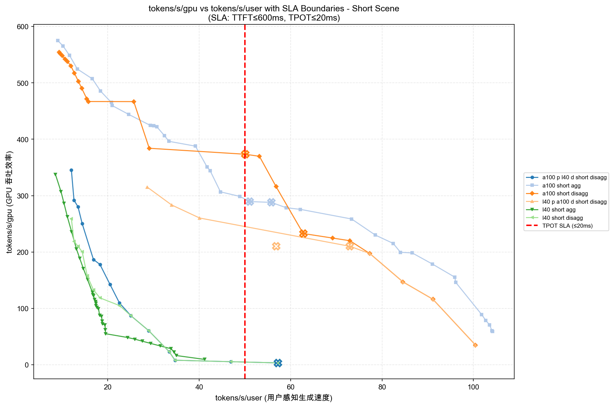
*图 7：Short场景tokens/s/gpu与tokens/s/user分布。图中叉号标出满足SLA的最优点（吞吐最优），用于评估其在TPOT约束下的余度稳定性。*
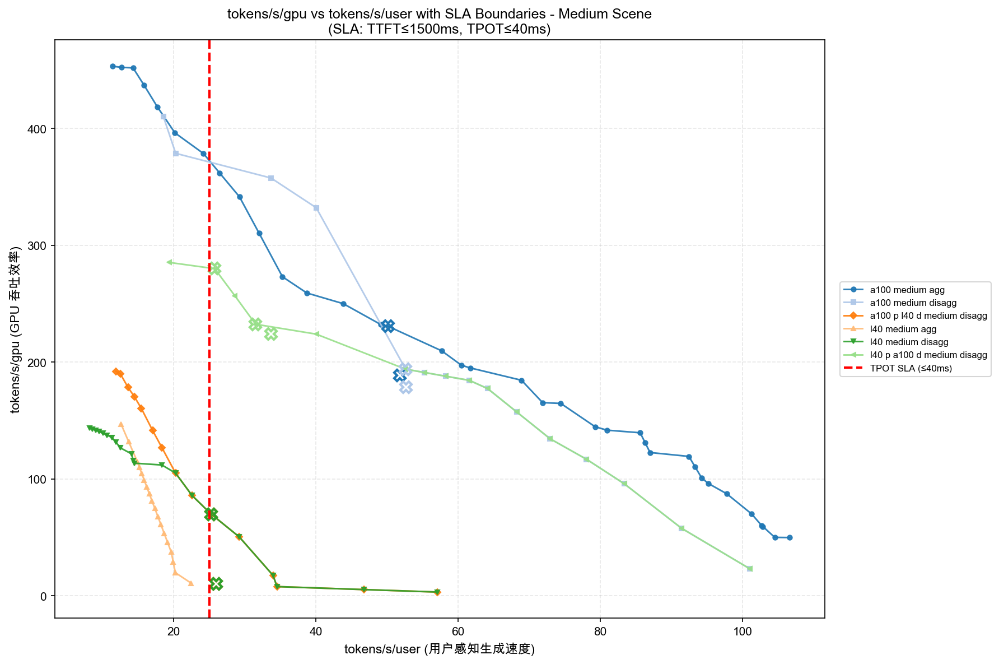
*图 8：Medium场景tokens/s/gpu与tokens/s/user分布。图中叉号标出满足SLA的最优点（吞吐最优），用于评估其在TPOT约束下的余度稳定性。*
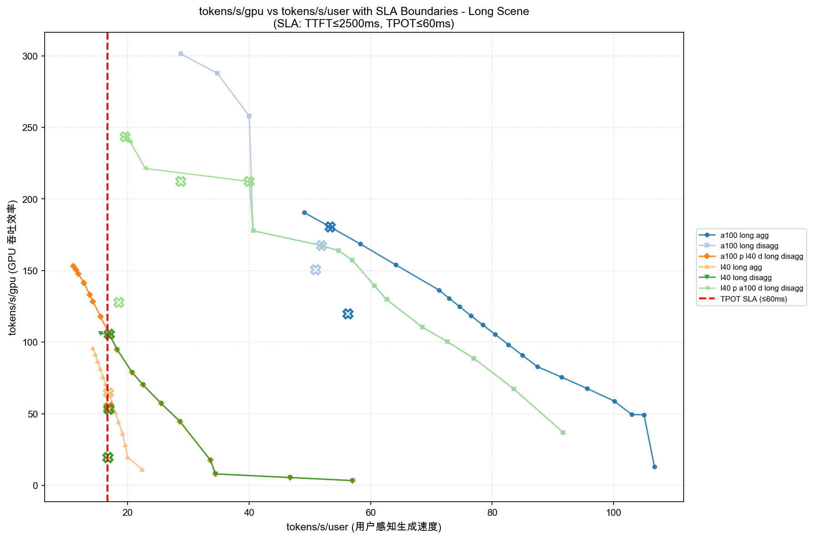
*图 9：Long场景tokens/s/gpu与tokens/s/user分布。图中叉号标出满足SLA的最优点（吞吐最优），用于评估其在TPOT约束下的余度稳定性。*

从结果看：

- `Short` 场景余量较大，稳健性较高。
- `Medium` 场景 `TPOT` 余量仅约 `3%`，接近边界。
- `Long` 场景整体可行，但余量仍偏小。

因此，更准确的表述是：`L40_P_A100_D` 是当前约束下的优选方案，但它在不同场景下的稳健性并不均匀，部署策略应分场景制定。

### 5.2 用卡成本对性价比结论的影响

分析结果表明，混推方案的成本优势依赖于 `L40` 的价格区间。当 `L40` 月成本低于约 `2.5 万` 时，`L40_P_A100_D` 保持明显优势；当价格继续上升时，这一优势会收敛，甚至可能被纯 `A100` 架构反超。

*图 10：全场景* `tokens/s/10k` *与* `tokens/s/user` *帕累托分布。该图更直接体现了价格变化和架构选择对成本效益边界的影响。*

进一步看，我们比较的不只是单个方案的成本收益，也看了 GPU 价格变化会怎样影响帕累托曲线。价格变化不会改变各架构本身的性能机理，但会改变性能和成本之间的相对位置，从而让帕累托前沿发生移动。也就是说，一个方案是不是还在最优边界上，不只看吞吐和时延，也要看对应 GPU 的价格。

这也说明，混推的性价比结论不是一个脱离价格条件的硬件结论，而是“硬件能力 + 价格条件”共同作用的结果。对成本敏感型决策来说，价格波动本身就是分析的一部分；我们要看的不只是某个方案此刻是不是最优，还要看价格变化之后，它是不是还在帕累托前沿附近。

### 5.3 反向架构验证说明结论具有机理基础

`A100_P_L40_D` 在多个场景中都明显更差，这一点很有说明力。它说明这次结论不是偶然碰巧试出了一个更优组合，而是背后确实有比较清楚的机理基础：阶段和资源之间存在方向性的匹配关系。

换句话说，不是“只要异构就更优”，而是“分工对了，异构才更优”。

### 5.4 单点性能分析不足以直接支撑架构决策

这里有一个很重要的判断：单点性能测试可以帮助我们理解局部硬件特征，但还不够直接支撑推理系统架构结论。系统表现同时受到阶段分离、`TP` 配置、worker 数量、通信效率、缓存命中率和业务 `SLA` 的共同影响。

因此，更合理的方法是：

1. 用单点测试做参数校准。
2. 在完整配置空间内做系统级搜索。
3. 用跨场景、规模扩展和敏感性分析验证结论。

### 5.5 规模扩展带来的收益不只是线性堆卡

单位 GPU 效率随规模提升而改善，说明规模化部署的收益不仅来自资源总量增加，也来自更灵活的配置空间、更优的 worker 组合以及相对更低的通信开销占比。

这对大规模推理服务很重要，因为它说明系统优化空间有相当一部分来自架构和配置设计，而不只是继续堆硬件。

## 6. 结论

1. 在给定场景和 `SLA` 约束下，`L40_P_A100_D` 是当前更值得推进的方案。它的优势主要体现在成本效益，`Short`场景的用户体验也更好。
2. 这个方案不是在所有场景下都同样稳。`Short` 场景最稳健，适合优先推进；`Medium` 和 `Long` 场景可以做，但需要更保守，尤其要重点关注 `TPOT` 余量。
3. 这次更重要的收获，不只是得到一个混推结论，而是把一套分析方法跑通了。后续再做硬件选型、引擎比较和架构调整，建议都按同一套框架来分析：先定义 `SLA` 和目标，再看帕累托前沿、稳健性和成本敏感性。

## 附录 A：完整数据表

#### A.1 跨场景对比总表

|   |   |   |   |   |   |   |
|---|---|---|---|---|---|---|
|**架构**|**场景**|**tokens/s/****gpu**|**tokens/s/user**|**tokens/s/10k_rmb**|**TTFT(ms)**|**TPOT(ms)**|
|**基线**|||||||
|a100_agg|Short|289.44|51.02|661.59|455.7|19.6|
|a100_agg|Medium|230.78|50.16|527.49|785|19.9|
|a100_agg|Long|180.54|53.32|412.65|722.9|18.8|
|**混合架构**|||||||
|**L40_P_A100_D**|Short|210.1|**72.99 (+43%)**|**672.31 (+1.6%)**|246.7|13.7|
|**L40_P_A100_D**|Medium|**280.08 (+21%)**|25.78|**689.43 (+31%)**|925.6|38.8|
|**L40_P_A100_D**|Long|**243.40 (+35%)**|19.58|**599.13 (+45%)**|1908.8|51.1|
|**对比架构**|||||||
|a100_disagg|Short|**373.42 (+29%)**|50.04|426.77|277.7|20|
|a100_disagg|Medium|194.04|**52.63 (+5%)**|443.52|579.7|19|
|a100_disagg|Long|167.44|51.94|382.72|671.9|19.3|
|A100_P_L40_D|Short|3.32|57.24|10.62|277.7|17.5|
|A100_P_L40_D|Medium|69.95|25.29|172.18|1078.3|39.5|
|A100_P_L40_D|Long|105.57|16.98|259.86|2224.6|58.9|

全场景 Pareto 曲线汇总：
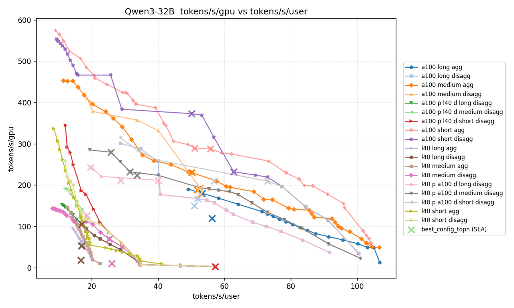

全场景成本效益汇总：
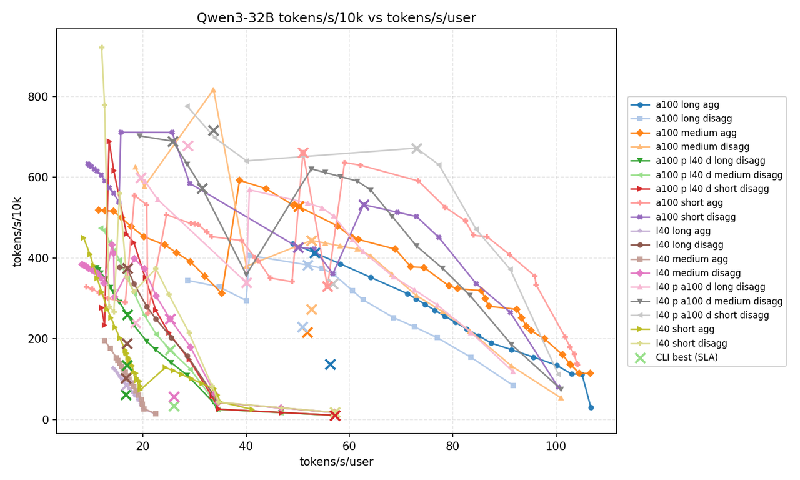

#### A.2 各场景详细数据

##### **Short场景数据**：

|   |   |   |   |   |   |   |
|---|---|---|---|---|---|---|
|**实验**|**tokens/s/****gpu**|**tokens/s/user**|**tokens/s/10k_rmb**|**GPUs**|**TTFT(ms)**|**TPOT(ms)**|
|a100_short_agg|289.44|51.02|661.59|8|455.75|19.6|
|l40_p_a100_d_short_disagg|210.1|72.99|672.31|16|246.73|13.7|
|a100_short_disagg|373.42|50.04|426.77|8|277.65|19.98|
|l40_short_disagg|3.32|57.24|17.7|16|246.73|17.47|
|a100_p_l40_d_short_disagg|3.32|57.24|10.62|16|277.65|17.47|

Short 场景 Pareto 曲线：
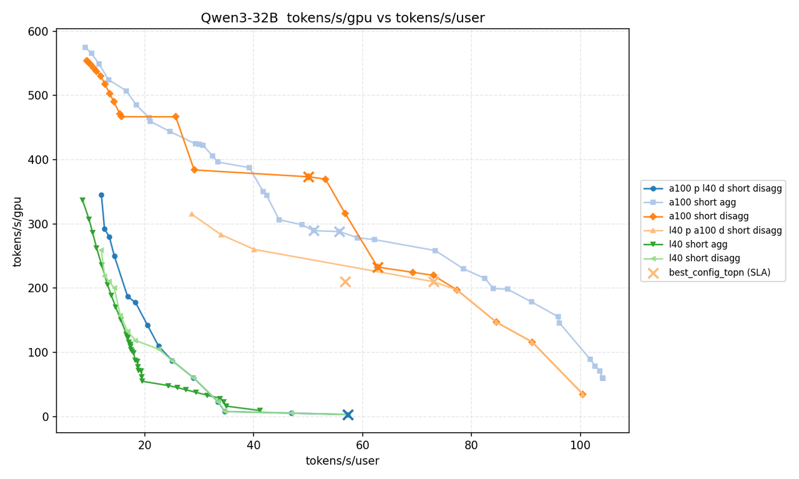
Short 场景成本效益曲线：
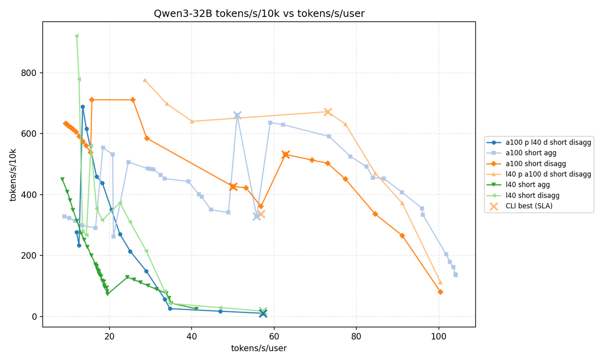

核心发现：

- 用户体验优先：`L40_P_A100_D` 用户性能提升 43%，TTFT 仅 246.7ms
    
- GPU 效率优先：`a100_disagg` GPU 效率提升 29%
    

##### **Medium场景数据**：

|   |   |   |   |   |   |   |
|---|---|---|---|---|---|---|
|**实验**|**tokens/s/****gpu**|**tokens/s/user**|**tokens/s/10k_rmb**|**GPUs**|**TTFT(ms)**|**TPOT(ms)**|
|a100_medium_agg|230.78|50.16|527.49|8|785.03|19.94|
|l40_p_a100_d_medium_disagg|280.08|25.78|689.43|16|925.61|38.79|
|a100_medium_disagg|194.04|52.63|443.52|16|579.75|19|
|l40_medium_disagg|69.95|25.29|248.71|16|925.61|39.55|
|a100_p_l40_d_medium_disagg|69.95|25.29|172.18|16|1078.32|39.55|

Medium 场景 Pareto 曲线：
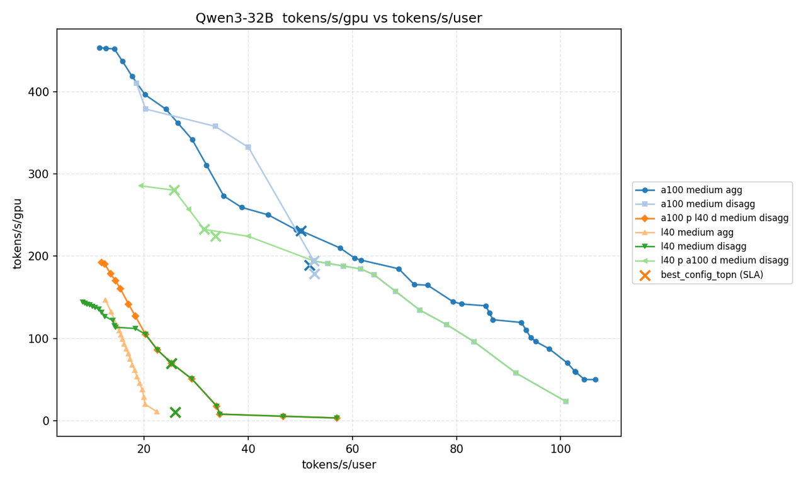

Medium 场景成本效益曲线：
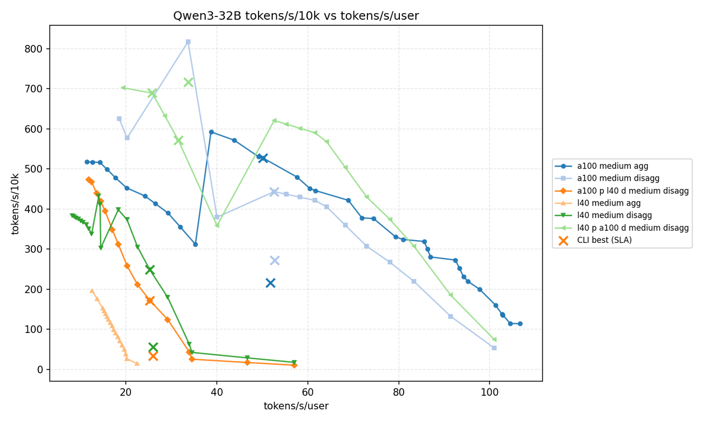
  

核心发现：

- 成本优化推荐：`L40_P_A100_D` 成本效益提升 31%
    
- 用户体验保留：`a100_disagg` 保持用户体验同时略有提升
    

##### **Long场景数据**：

|   |   |   |   |   |   |   |
|---|---|---|---|---|---|---|
|**实验**|**tokens/s/****gpu**|**tokens/s/user**|**tokens/s/10k_rmb**|**GPUs**|**TTFT(ms)**|**TPOT(ms)**|
|a100_long_agg|180.53|53.31|412.65|8|722.89|18.76|
|l40_p_a100_d_long_disagg|243.4|19.58|599.13|16|1908.81|51.06|
|a100_long_disagg|167.44|51.94|382.72|16|671.93|19.25|
|l40_long_disagg|105.57|16.98|375.36|16|1908.81|58.88|
|a100_p_l40_d_long_disagg|105.57|16.98|259.86|16|2224.62|58.88|

Long 场景 Pareto 曲线：
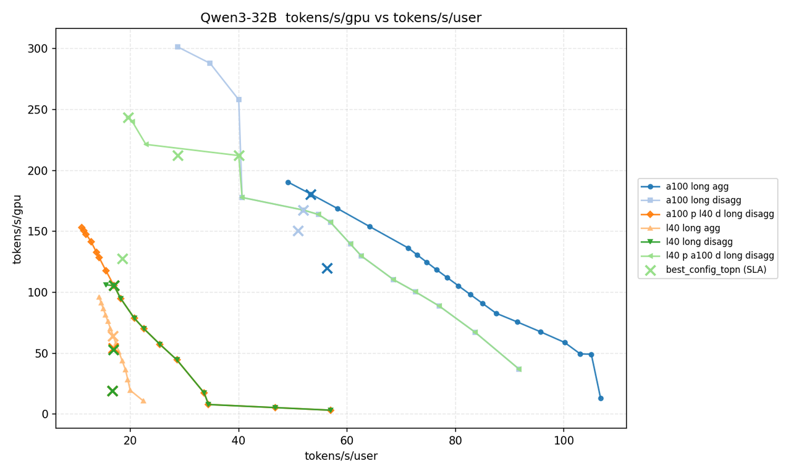

Long 场景成本效益曲线：
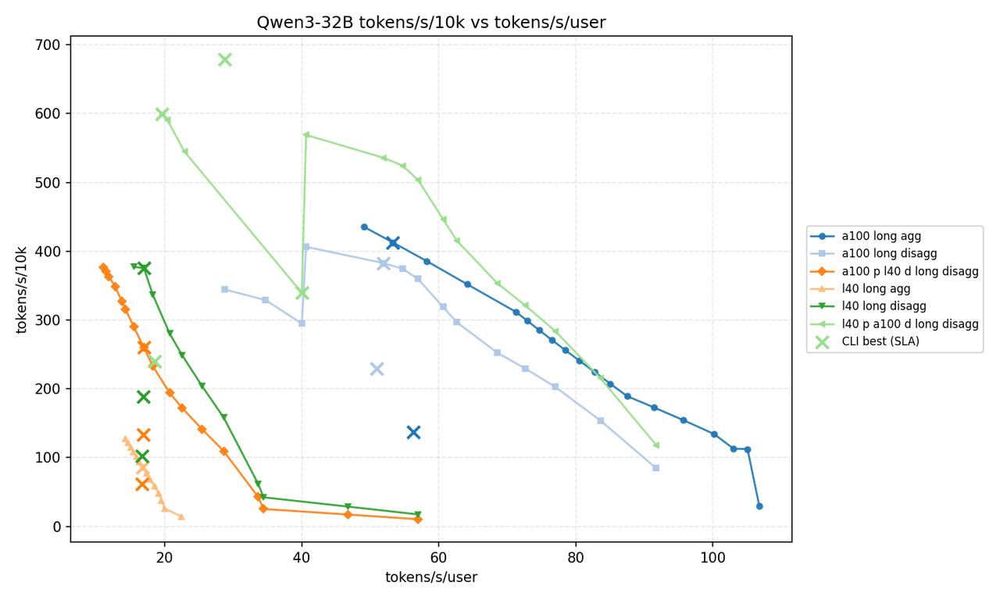
  

核心发现：

- 最佳成本效益：`L40_P_A100_D` 成本效益提升 45%
    
- 用户体验保留：`a100_disagg` 性能下降仅 3%
    

---

## 附录B： 验证详情

#### B.1 跨场景一致性验证（成本效益）

|   |   |   |   |   |   |
|---|---|---|---|---|---|
|**架构**|**Short**|**Medium**|**Long**|**趋势**|**验证状态**|
|L40_P_A100_D|672.31 (+58%)|689.43 (+55%)|599.13 (+57%)|稳定领先|通过|
|A100_P_L40_D|10.62 (-98%)|172.18 (-75%)|259.86 (-57%)|持续落后|通过|
|纯 A100 Disagg|426.77 (基准)|443.52 (基准)|382.72 (基准)|基准线|-|

#### B.2 反向架构验证

|   |   |   |   |   |
|---|---|---|---|---|
|**对比项**|**L40_P_A100_D**|**A100_P_L40_D**|**差距**|**验证状态**|
|Short 成本效益|672.31|10.62|-98%|符合预期|
|Medium 成本效益|689.43|172.18|-75%|符合预期|
|Long 成本效益|599.13|259.86|-57%|符合预期|

**机理解释**：A100_P_L40_D 差的原因：

- A100 做 Prefill：算力优势不明显（312 vs 362 TFLOPS，仅落后 14%）
    
- L40 做 Decode：带宽劣势明显（864 GB/s vs 2.039 TB/s，落后 57%）
    

#### B.3 GPU 扩展验证数据

|   |   |   |   |   |   |   |
|---|---|---|---|---|---|---|
|**实验**|**tokens/s/****gpu**|**tokens/s**|**tokens/s/10k_rmb**|**GPUs**|**TTFT(ms)**|**TPOT(ms)**|
|exp_gpus_8|252.54|2020.29|404.06|8|925.61|49.27|
|exp_gpus_16|280.08|4481.28|689.43|16|925.61|38.79|
|exp_gpus_32|308.09|9858.82|857.29|32|925.61|49.27|

- 吞吐量扩展性良好：近似线性增长（2.22x, 2.20x）
    
- tokens/s/gpu 随规模提升：呈现**超线性特征** (+22%)
    
- 成本效益提升：大规模部署更经济
    

**超线性特征原因分析**：

1. **Worker 配置灵活性增加**
    
    1. 更大规模下，AIC 可选择更多 worker 组合
        
    2. 例如：32 GPUs 可配置 P:TP=2,workers=11; D:TP=2,workers=5
        
    3. 相比 8 GPUs 配置更优化
        
2. **通信开销相对降低**
    
    1. 大规模部署时，节点内通信占比更高
        
    2. NCCL 节点内带宽（~600 GB/s）远高于节点间（~50 GB/s）
        
3. **Batch Size 优化空间更大**
    
    1. 更多 GPU 意味着可支持更大的 batch size
        
    2. 更好的 GPU 利用率
        

#### B.4 SLA 阈值敏感性验证

L40_P_A100_D 架构，Medium 场景：

|   |   |   |
|---|---|---|
|**SLA** **约束 (TTFT/TPOT)**|**tokens/s/****gpu**|**状态**|
|2000ms / 80ms|308.09|有解|
|1500ms / 60ms|308.09|有解|
|1000ms / 50ms|308.09|有解|
|800ms / 40ms|-|无可行配置|
|600ms / 30ms|-|无可行配置|

- 宽松 SLA 下配置稳定
    

#### B.5 成本敏感性详情

|   |   |   |   |   |
|---|---|---|---|---|
|L40 价格|混合架构成本效益|vs A100 Agg|vs A100 Disagg|结论|
|1.5万|689.43|+31%|+55%|显著优势|
|2.0万|597.50|+13%|+35%|仍有优势|
|2.5万|527.21|+0%|+19%|持平/略有优势|
|3.0万|471.71|-11%|+6%|略低于A100 Agg|
|3.5万|426.79|-24%|-4%|低于A100架构|

**关键发现**：

- 稳健性区间：L40 价格在 2.5万以下时，混合架构保持成本优势
    
- 安全边际：当前 L40 市场价格 (~1.5万) 远低于临界点
    

---

## 附录C：参考资料

- AIC 论文：[https://arxiv.org/html/2601.06288v1](https://arxiv.org/html/2601.06288v1)
    
- AIC CLI 用户手册：[https://github.com/ai-dynamo/aiconfigurator/blob/main/docs/cli_user_guide.md](https://github.com/ai-dynamo/aiconfigurator/blob/main/docs/cli_user_guide.md)
    
- Splitwise (OSDI'24)：分离架构理论基础 [https://arxiv.org/html/2311.18677v2](https://arxiv.org/html/2311.18677v2)
    
- DistServe (OSDI'24)：Prefill/Decode 分离优化 [https://arxiv.org/html/2401.09670v3](https://arxiv.org/html/2401.09670v3)
    

---
